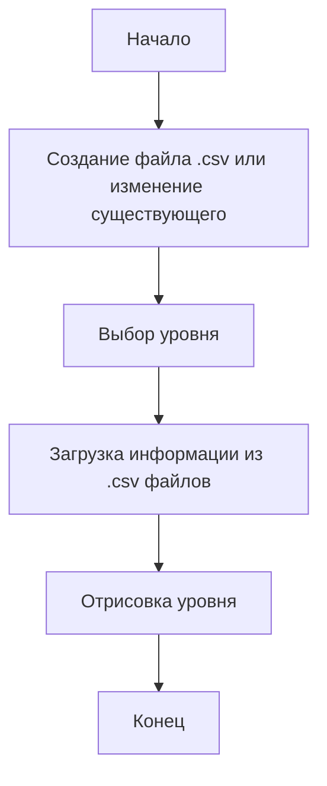
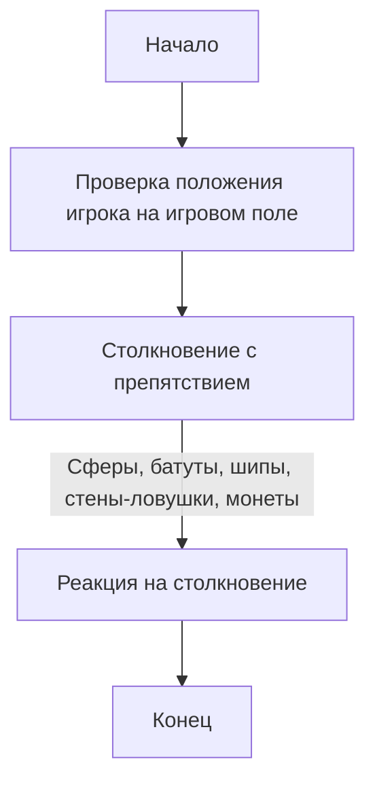
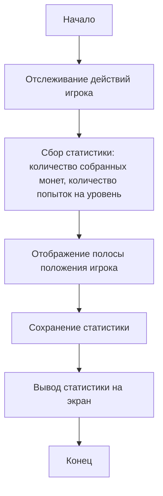

# Функциональные модели
---

## Сценарии использования

### Отрисовка уровня

 - **Пользователь делает:** Создает файл в формате .csv с определенным набором символов в текстовом редакторе или вносит изменения в уже существующие файлы.

 - **Приложение делает:** При старте игры загружает информацию из .csv файлов и отрисовывает уровень, основываясь на написанных символах.

 - **Пользователь:** Выбирает уровень, на котором хочет играть.

 - **Приложение:** Отображает выбранный уровень. В игре присутствует 2 уровня, и после прохождения первого пользователь переходит на следующий. Таким образом, можно добавлять любое количество разных уровней.

### Создание усложнений на уровнях

 - **Пользователь делает:** Играет на уровнях, где присутствуют разные усложнения.

 - **Приложение делает:** Непрерывно проверяет положение игрока на игровом поле и определяет, происходит ли столкновение с препятствием. В случае столкновения, с игроком происходит то или иное событие, определяемое предметом.

 - **Пользователь:** Сталкивается с различными препятствиями на уровне, такими как сферы, батуты, шипы, стены-ловушки и монеты.

 - **Приложение:** Реагирует на столкновения и обрабатывает их соответствующим образом.

### Сбор статистики за игру

 - **Пользователь делает:** Играет в игру.

 - **Приложение делает:** Отслеживает действия игрока, такие как количество собранных монет и количество попыток на уровень. Выводит на экран полосу, показывающую положение игрока относительно старта и финиша. Статистика сохраняется для последующего просмотра пользователем после прохождения уровня.

 - **Пользователь делает:** Подбирает монету

 - **Приложение делает:** Увеличивает счетчик монет

 - **Пользователь делает:** Проигрывает на уровне

 - **Приложение делает:** Увеличивает счетчик попыток на этот уровень (количество смертей)

 - **Пользователь делает:** Двигается по уровню (начинает процесс прохождения уровня)

 - **Приложение делает:** Создает полосу, показывающую текущее положение игрока, а также выводит на экран процент пройденного расстояния(всего 100%) при поражении на этом уровне

## Диаграмма вариантов использования приложения

## Диаграммы активности

### Диаграмма активности: Отрисовка уровня

    
### Диаграмма активности: Создание усложнений на уровнях

    
### Диаграмма активности: Сбор статистики за игру

