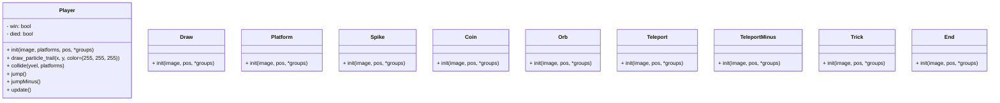

# Структурные модели

```mermaid
classDiagram
    class Player
    class Draw
    class Platform
    class Spike
    class Coin
    class Orb
    class Teleport
    class TeleportMinus
    class Trick
    class End

    class Player {
        - win: bool
        - died: bool
        + init(image, platforms, pos, *groups)
        + draw_particle_trail(x, y, color=(255, 255, 255))
        + collide(yvel, platforms)
        + jump()
        + jumpMinus()
        + update()
    }

    class Draw {
        + init(image, pos, *groups)
    }

    class Platform {
        + init(image, pos, *groups)
    }

    class Spike {
        + init(image, pos, *groups)
    }

    class Coin {
        + init(image, pos, *groups)
    }

    class Orb {
        + init(image, pos, *groups)
    }

    class Teleport {
        + init(image, pos, *groups)
    }

    class TeleportMinus {
        + init(image, pos, *groups)
    }

    class Trick {
        + init(image, pos, *groups)
    }

    class End {
        + init(image, pos, *groups)
    }


```
