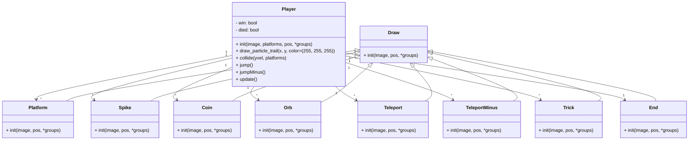

# Структурные модели

```mermaid
classDiagram
    class Player {
        - win: bool
        - died: bool
        + init(image, platforms, pos, *groups)
        + draw_particle_trail(x, y, color=(255, 255, 255))
        + collide(yvel, platforms)
        + jump()
        + jumpMinus()
        + update()
    }

    class Draw {
        + init(image, pos, *groups)
    }

    class Platform {
        + init(image, pos, *groups)
    }

    class Spike {
        + init(image, pos, *groups)
    }

    class Coin {
        + init(image, pos, *groups)
    }

    class Orb {
        + init(image, pos, *groups)
    }

    class Teleport {
        + init(image, pos, *groups)
    }

    class TeleportMinus {
        + init(image, pos, *groups)
    }

    class Trick {
        + init(image, pos, *groups)
    }

    class End {
        + init(image, pos, *groups)
    }

    Player "1" --> "*" Platform
    Player "1" --> "*" Spike
    Player "1" --> "*" Coin
    Player "1" --> "*" Orb
    Player "1" --> "*" Teleport
    Player "1" --> "*" TeleportMinus
    Player "1" --> "*" Trick
    Player "1" --> "1" End

    Draw <|-- Platform
    Draw <|-- Spike
    Draw <|-- Coin
    Draw <|-- Orb
    Draw <|-- Teleport
    Draw <|-- TeleportMinus
    Draw <|-- Trick
    Draw <|-- End
```
